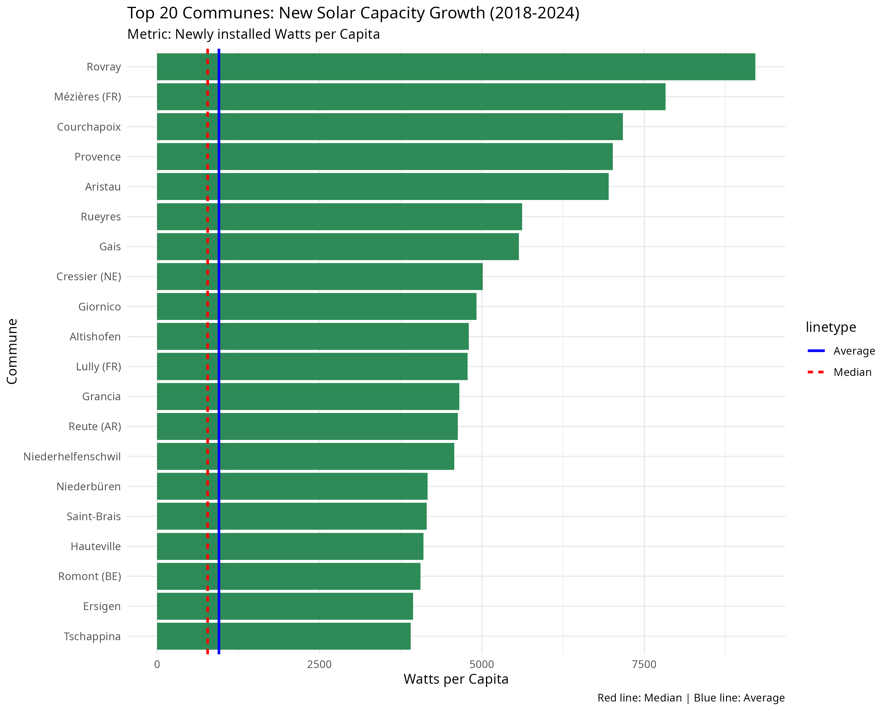
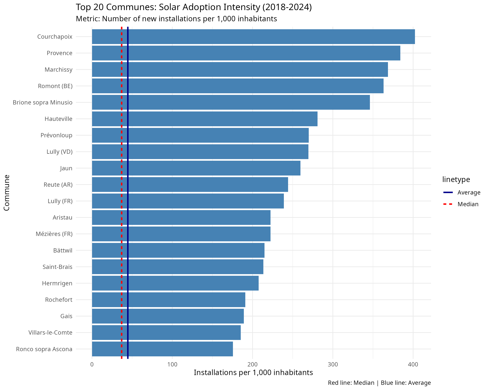

# 🇨🇭 Swiss Solar Growth Analysis (2018–2024)

This project analyzes the determinants of photovoltaic (PV) adoption across Swiss municipalities during the implementation phase of the **Energy Strategy 2050**.

By merging administrative energy data with socio-economic indicators, we isolate the **growth** of solar capacity between **2018 and 2024**, identifying which communes are successfully driving the energy transition.

## 📊 Preliminary Results (Top 20)

We rank municipalities using two distinct "Success Metrics":

### 1. Capacity Density (The "Power" Leaders)
*Metric: Newly installed Watts per Capita (2018–2024)*


### 2. Adoption Intensity (The "Frequency" Leaders)
*Metric: Number of new installations per 1,000 inhabitants*



## 🚀 How to Run This Project

### 1. Clone the Repository
```bash
git clone [https://github.com/drjacques-coder/SwissSolarStats.git](https://github.com/drjacques-coder/SwissSolarStats.git)
```

### 2. Setup Data Folders

This project relies on external administrative data. You must create the following folder structure and download the data manually (due to size/license):

#### A. Solar Data (SFOE)

    Download: Elektrizitätsproduktionsanlagen (BFE)

    Folder: Import BFE Elektrizitätsproduktionsanlagen 31.10.25

    File: ElectricityProductionPlant.csv

#### B. Geography Data (Swisstopo)

    Download: Amtliches Ortschaftsverzeichnis (Swisstopo) -> CSV format

    Folder: Import Swisstopo/

    File: AMTOVZ_CSV_LV95.csv

#### C. Population Data (BFS)

    Download: Population Statistics (STAT-TAB) -> Export as JSON

    Folder: Import BFS Commune/

    File: px-x-0102020000_201.json

### 3. Run the Analysis

Open SwissSolarStats.Rproj in RStudio and run the script 01_load_and_clean.R.
